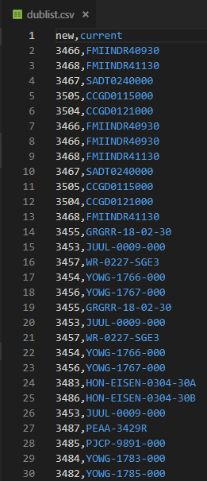

# DubScript
 ## Behavior 
 
 Dubscript Automatically moves files from the dump folder to the production folder, renames, and converts them from .mp3 to .wav.

Note that the dublist often calls for naming multiple unique files from the dump folder to the *same* name in the production folder, resulting in DubScript overwriting the file multiple times. This is generally okay. See [Logging](#logging) if you encounter a missing spot and need to fix it.

## Requirements

* [FFmpeg](https://www.ffmpeg.org/) for file conversion.

## Setup dublist.csv

1. Convert the weekly dublist.pdf to .xlsx one way or another. [This](pdftoexcel.com) is a good site to use.

2. Remove all text that isn't in the `Media #` or `ISCI` columns, including the column headers.

3. Create new column headers. In cell **1A**, enter `new`. In cell **1B**, enter `current`.

4. Cut all `Media #` and `ISCI` entries and paste them under the `new` and `current` headers you just made.

5. Save the file as `DubScript\dublist\dublist.csv`

6. I prefer to do this step in VS Code. Remove all characters from the `new` column that aren't going to be part of the filename (I.E., remove all occurrances of "NET" so the entries under `new` are only numbers). Remove all extraneous commas. Save the file again. Refer to the example below for what the final product should look like.

7. Edit DubScript.ps1 to make sure `$csv` (dublist.csv), `$original_path` (dump folder), and `$destination_path` (production folder) are pointing to the right places.

## Execution

* Right click DubScript.ps1 > Run with PowerShell

## Logging

Logging is pretty basic. It only really exists to prove that `somefile.mp3` was moved to the production folder and converted to `somefile.wav` on the off chance someone asks. The log will show you what files get overwritten since multiple files often want the same name, so if there is a missing spot somewhere, you can see if it was overwritten. and fix it manually if necessary.

## Future Plans

* Automate the conversion of .pdf to .csv and as much formatting as possible.

* Logging for fail states. Right now it only logs expected behavior.

* Prompt for paths instead of hard-coding them.

* GUI?